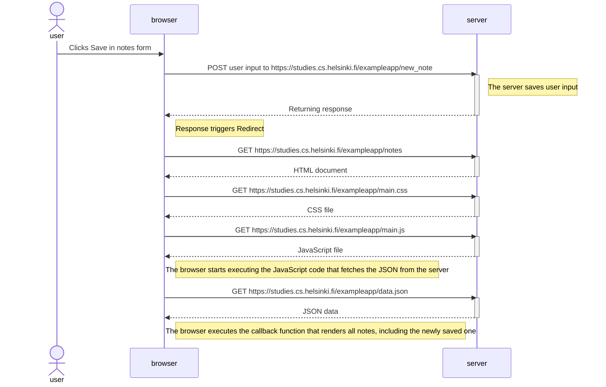

```mermaid
    sequenceDiagram
        actor user
        participant browser
        participant server

        user->>browser: Clicks Save in notes form
        browser->>server: POST user input to https://studies.cs.helsinki.fi/exampleapp/new_note
        activate server
        Note right of server: The server saves user input
        server-->>browser: Returning response
        deactivate server
        Note right of browser: Response triggers Redirect

        browser->>server: GET https://studies.cs.helsinki.fi/exampleapp/notes
        activate server
        server-->>browser: HTML document
        deactivate server

        browser->>server: GET https://studies.cs.helsinki.fi/exampleapp/main.css
        activate server
        server-->>browser: CSS file
        deactivate server

        browser->>server: GET https://studies.cs.helsinki.fi/exampleapp/main.js
        activate server
        server-->>browser: JavaScript file
        deactivate server

        Note right of browser: The browser starts executing the JavaScript code that fetches the JSON from the server

        browser->>server: GET https://studies.cs.helsinki.fi/exampleapp/data.json
        activate server
        server-->>browser: JSON data
        deactivate server

        Note right of browser: The browser executes the callback function that renders all notes, including the newly saved one
```